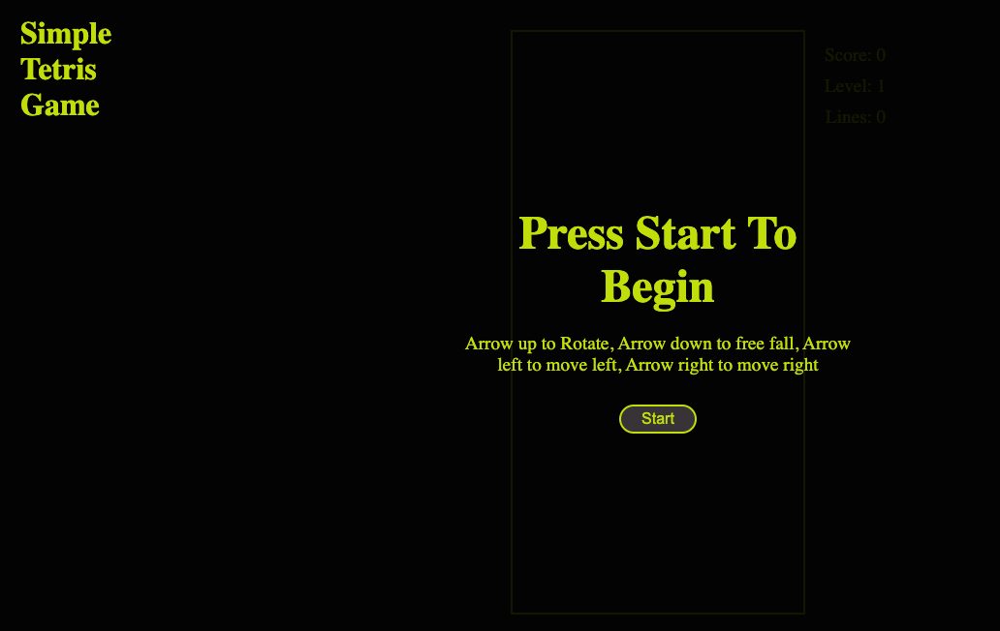

# 🧩 Tetris Game  
  

A clean, browser-based clone of the classic **Tetris** game. Built to be lightweight, responsive, and easily extendable.

---

## 🔗 Play Online  
Play the game instantly here:  
👉 **https://yournd.github.io/se_project_tetris_game/**

---

## 📷 Screenshots  

### Start Screen  

---

## 🎮 Features

- Classic falling-block gameplay  
- Dynamic **score**, **level**, and **line-clear** tracking  
- Level-based speed scaling  
- Smooth keyboard controls:
  - ⬆️ Rotate  
  - ⬅️ / ➡️ Move left/right  
  - ⬇️ Soft drop  
- Clean, ad-free interface  
- **Start** and **Retry** buttons  
- Works on any modern desktop browser  

---

## 🕹️ How to Play

1. Click **Start** to begin.  
2. Use arrow keys to control pieces.  
3. Complete horizontal lines to earn points and level up.  
4. The game ends when the stack reaches the top.  
5. Click **Retry** to try again.

---

## 📁 Project Structure

/index.html -> HTML structure and game container
/style.css -> Styling and layout
/script.js -> Game logic, rendering, keyboard input
/screenshots/ -> Images used in README
/assets/ -> Optional images/sounds

---

## 🚀 Local Setup

Clone the repository:

git clone https://github.com/yournd/se_project_tetris_game.git

cd se_project_tetris_game

Open index.html in your browser — that’s it.
