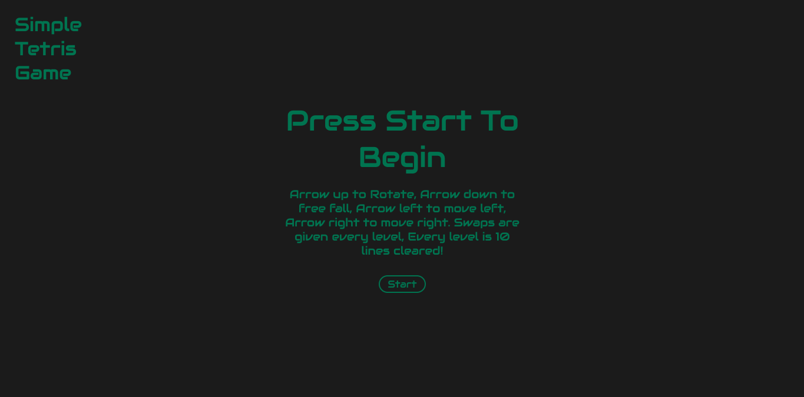
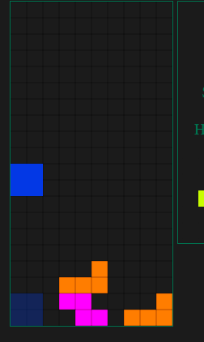
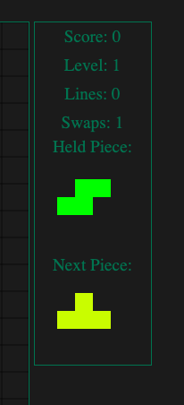
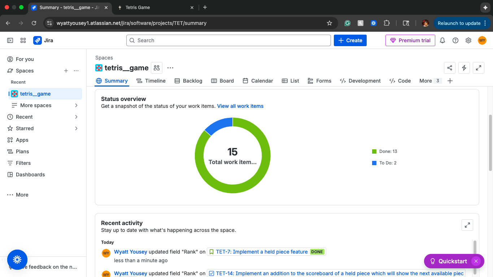
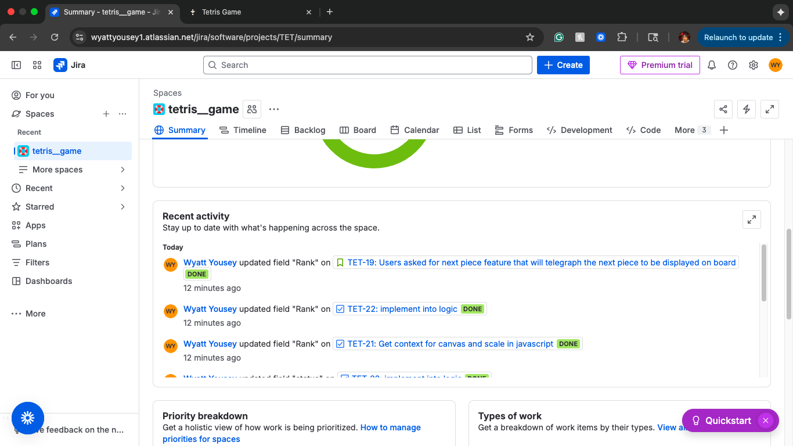
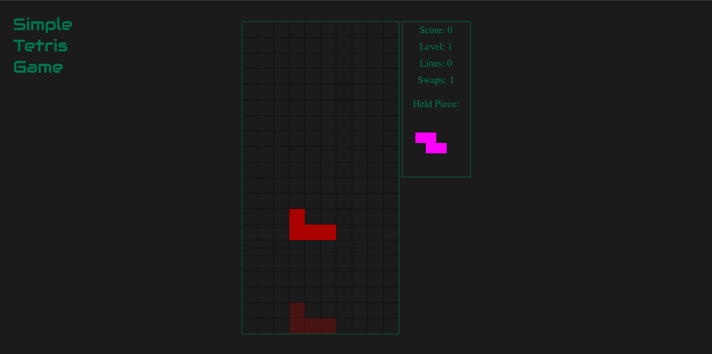
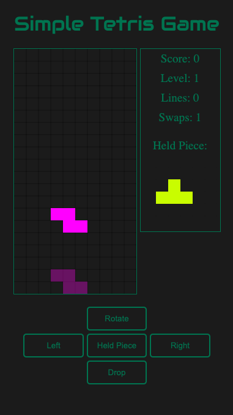

# 🧩 Tetris Game  
  

A polished, browser-based clone of the classic **Tetris** game — now enhanced with **Ghost Piece**, **Hold Piece**, and full **mobile optimization**.  
Built to be lightweight, responsive, and customizable.

---

## 🔗 Play Online  
!! Mobile users will not be able to zoom, as it makes gameplay difficult !!
👉 **https://yournd.github.io/se_project_tetris_game/**

---

## 📱 Now Fully Mobile-Optimized  
The entire experience has been redesigned to work smoothly on mobile devices:

- Responsive layout  
- Touch controls (optional)  
- Scales correctly on all screen sizes  
- Updated mobile-friendly UI (see screenshots below)

---

## 🎮 Features

### 🧱 Core Gameplay
- Classic falling-block Tetris  
- Clean, responsive interface  
- Score, level, and line-clear tracking  
- Level-based speed scaling  
- Smooth keyboard controls  
  - ⬆️ Rotate  
  - ⬅️ / ➡️ Move left / right  
  - ⬇️ Soft drop  

### 👻 **Ghost Piece**
- A translucent outline shows where the current piece will land  
- Updates based on rotation and movement  
- Helps with planning and faster play  

### 🔄 **Held Piece**
- Swap the current piece into a **hold slot**  
- Retrieve the held piece at any time  
- Enables advanced strategy and combos  

### 🎛 UI Features
- Start screen  
- Game over + retry  
- Sidebar with next pieces, held piece, and stats  
- Completely ad-free  

---

## 📷 Screenshots  

### Start Screen  

### Ghost Piece Example  

### Held Piece Display  

---

## 🆕 Most Recent Updates

### 📌 Agile/Scrum Production Tracking (Jira)

### 🎨 Updated Color Theme  

### 📱 Updated Mobile Layout  

---

## 📁 Project Structure

/index.html -> HTML structure and game container
/style.css -> Styling and layout
/script.js -> Game logic, rendering, keyboard input
/screenshots/ -> Images used in README
/assets/ -> Optional images/sounds

---

## 🚀 Local Setup

Clone the repository:

git clone https://github.com/yournd/se_project_tetris_game.git

cd se_project_tetris_game

Open index.html in your browser — that’s it.
